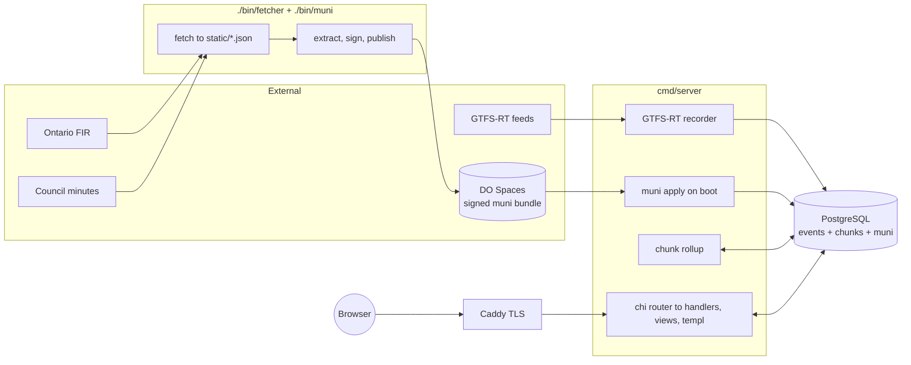

# Thunder Citizen

Thunder Bay data aggregator: transit, budget, council. Alpha software, breaks at will. Source is open under Apache 2.0.

_Updated: 2026-05-11_

## What's in the box

- **Go** server (chi, templ, pgx/v5) + **PostgreSQL** (PostGIS) + **Caddy** in front
- **Transit**: records GTFS-RT into append-only event tables, derives KPIs (OTP, EWT, headway Cv, cancellations) into per-route/day/band chunks
- **Budget**: Ontario FIR pulled, normalized into JSON, rendered as Sankey
- **Council**: minutes scraped, motions parsed + LLM-summarized, votes stored
- **Muni bundle**: signed TSV bundle of curated data shipped via DO Spaces, verified + applied on boot

## System



## Dev

```bash
docker compose up        # db + app on :8080
make dev                 # hot reload (templ + go + sass)
go test ./...
```

Migrations + muni bundle apply on boot. Full setup: [docs/development.md](docs/development.md). Architecture: [docs/architecture.md](docs/architecture.md).

## Deploy

Debian box, public IP, DNS pointed, ports 80/443 open:

```bash
git clone https://github.com/thundercitizen/home.git /opt/ThunderCitizen
cd /opt/ThunderCitizen
./scripts/harden.sh
curl -fsSL https://get.docker.com | sh
./scripts/deploy.sh      # idempotent, also the update path after git pull
```

Backups: `./scripts/backup.sh` writes `./backups/*.sql.gz`. Full runbook: [DEPLOY.md](DEPLOY.md).

## License

Apache 2.0. See [LICENSE](LICENSE).
